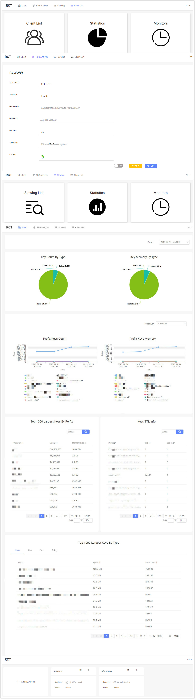

# RCT(Redis Computed Tomography)

  

RCT 是一个通过解析rdb文件对redis内存结构分析的一站式平台。 支持对非集群/集群rdb文件分析、Slowlog查询与监控、ClientList查询与监控。


## 功能
- 内存分析

  >通过对rdb文件解析，分析Redis内存使用情况，支持多维度、多报表方式。支持手动、自动多种方式！
  >提供生成报表、Redis key 导出等功能！

- slowlog

  >slowlog模块可以定时收集slowlog信息，多维度报表汇总，便捷查看集群当前slowlog详细信息。
  
- clientList

  >clientList模块可以便捷、高效分析查看客户端连接情况！
   

## 产品预览
截屏部分主要介绍了rct的主要功能,一系列的流程，您可以了解到我们平台主要功能和适用场景。


 
 ## 快速开始

 ### jre
 在开始之前，首先确保安装jre1.8+。

1. 首选启动控制中心RCT-Dashboard
   ```
   java -jar RCT-Dashboard-2.0.0.jar
   ```
2. 启动分析器RCT-Analyze
   ```
   java -jar -Xmx1024m -Xms300m RCT-Analyze-2.0.0.jar
   ```
   根据RDB大小，适当调整最大堆大小
3. 进入系统
   在浏览器中访问```http://127.0.0.1:8080```,输入账号与密码，默认账号密码为**rct/rct**
 ### docker
1. 首选启动控制中心RCT-Dashboard
  - 默认配置
    ```
    docker run -d  --net=host xaecbd/rct-dashboard:2.0.0
    ```
  - 自定义配置(在执行之前，请先在宿主机上放置config/application.properties db/data.db)
    ```
    docker run -d  -v /opt/app/rct/rct-dashboard/config:/opt/app/rct/rct-dashboard/config -v /opt/app/rct/rct-dashboard/db:/opt/app/rct/rct-dashboard/db --net=host xaecbd/rct-dashboard:2.0.0
    ```
2. 启动分析器RCT-Analyze
  - 默认配置
    ```
     docker run -d -e "JAVA_OPTIONS=-Xmx1024m -Xms300m" --net=host xaecbd/rct-analyze:2.0.0
    ```
  - 自定义配置(在执行之前，请先在宿主机上放置config/application.properties)
    ```
    docker run -d -e "JAVA_OPTIONS=-Xmx1024m -Xms300m" -v /opt/app/rct/rct-analyze/config:/opt/app/rct/rct-analyze/config -v /data/redis/redis_cluster:/data/redis/redis_cluster --net=host xaecbd/rct-analyze:2.0.0
    ```
    根据RDB大小，适当调整最大堆大小
3. 进入系统
   在浏览器中访问```http://127.0.0.1:8080```,输入账号与密码，默认账号密码为**rct/rct**
## 版本声明
目前仅限于支持以下版本，关于更高版本，正在开发中，敬请期待!

redis version|rct version
---|---
[2.6, 4.0.x]|2.0
## 用户手册
> 用户手册主要介绍RCT各模块的主要功能

1. [Chart模块介绍](./doc/Chart模块介绍.md)
2. [RDB分析模块介绍](./doc/如何使用RDB分析工具.md)
3. [SlowLog模块介绍](./doc/如何使用slowlog分析工具.md)
4. [ClientList模块介绍](./doc/如何使用clientList分析工具.md)

> RCT使用教程
1. [使用rdb分析工具快速分析](./doc/如何快速使用RDB分析工具进行分析.md)
2. [如何添加redis实例](./doc/如何增加redis实例.md)


## 产品设计
> 设计文档主要介绍 RCT 架构设计、框架设计

  1. [代码结构介绍](./doc/代码结构介绍.md) 
  2. [设计方案](./doc/设计方案.md) 
