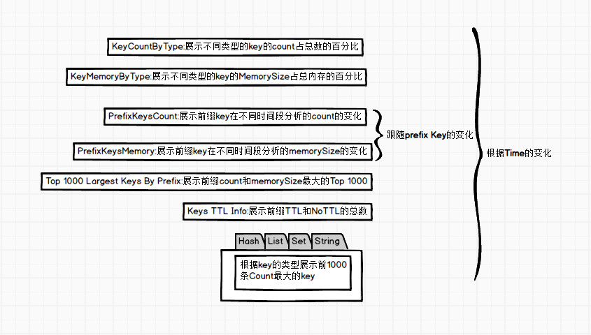

# Chart模块介绍

Chart module is used for RCT to display the analysis results of RDB visually

In this module, the latest Redis data analysis results are displayed, and the results of 7 times of analysis are retained in time. By changing the time, you can switch to view the data reports analyzed at different times.

## 1.Key Count By Type
Statistical summary of the number of different types of data
## 2.Key Memory By Type
Different types of data memory bytes estimated statistical summary
## 3.Prefix Keys Count
Count the number of key prefixes according to the corresponding rule
## 4.Prefix Keys Memory
The memory byte information of the key prefix is counted according to the corresponding rule
## 5.Top 1000 Largest Keys By Perfix
Count the Top 1000 prefix key according to the prefix rule
## 6.Keys TTL Info
The prefixes tell you how much data is set to TTL or not set to TTL
## 7.Top 1000 Largest Keys By Type
According to different data structures, top Count and Bytes are the largest 1000 pieces of data